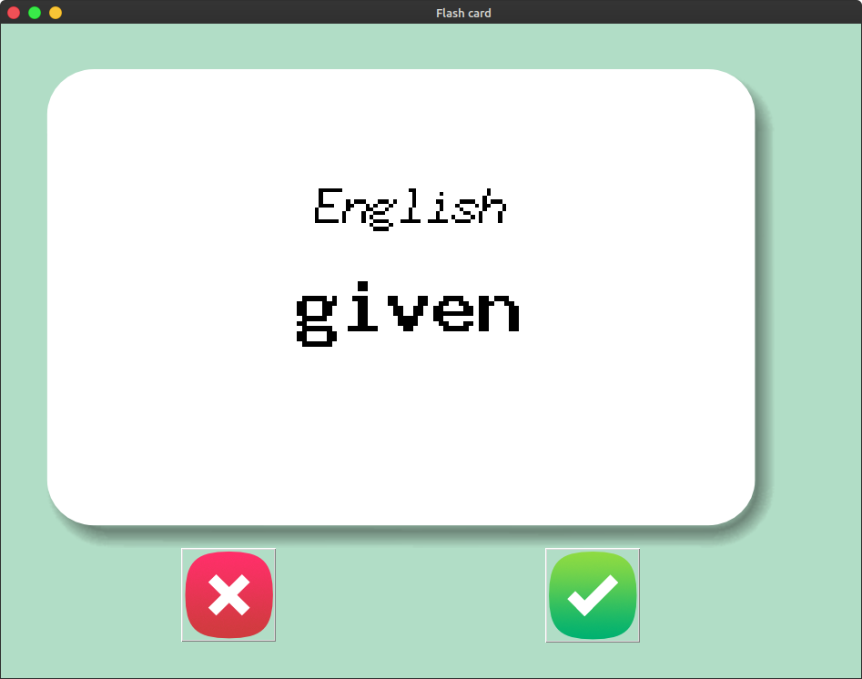
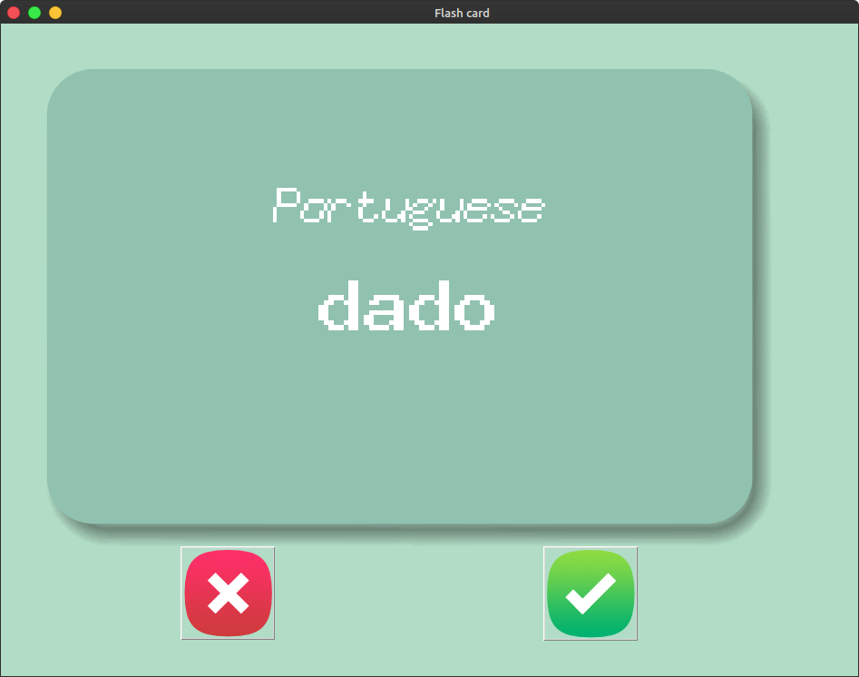

# flash-card-game

A flash card guess game where the user sees the word inside the canvas and tries to guess the portuguese meaning of that word within 3 seconds, and after this period of time, the card will flip and show the translation. If the users guessed the correct translation, he can click on the green button and the word will be removed from the list of the words he has to learn and will never show up again. The project was made with Tkinter for Graphical User Interface and Python for the programming.

  

    
  

  

    
  

